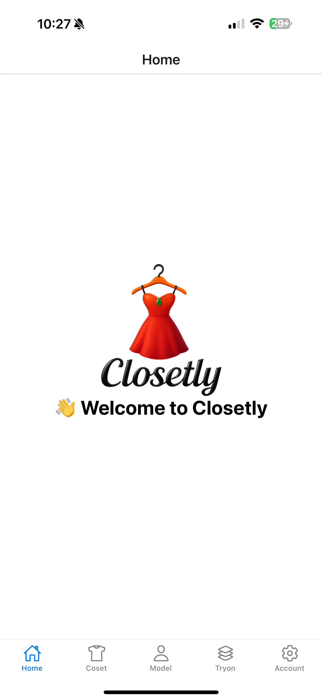
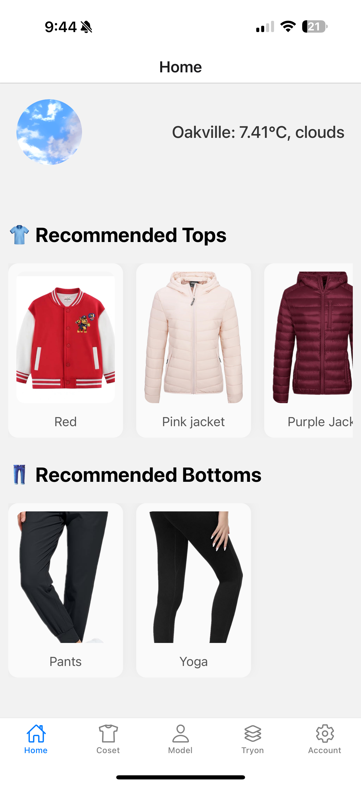
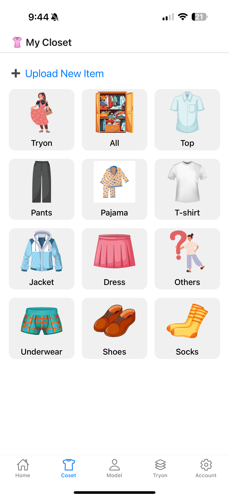
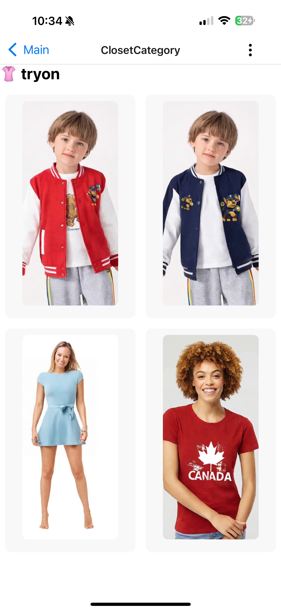

# 👚 Closetly - Smart AI Closet App

Closetly is a full-stack mobile app to manage your clothes, upload model photos, and virtually try on outfits.  
It integrates real-time weather-based recommendations, smart image handling, and AI-powered try-on using KLING API.

---

## 🛠️ Technologies Used

- **Frontend:** React Native (Expo)
- **Backend:** FastAPI (Python)
- **Database:** MongoDB (Atlas Cloud)
- **Cloud Storage:** Cloudinary
- **External APIs:**
  - IP Geolocation (`ipapi.co`)
  - OpenWeatherMap (Real-time Weather)
  - KLING Virtual Try-On API
- **Libraries:**
  - Axios
  - React Navigation
  - Animated API (Splash screen transitions)

---

## ✨ Core Features

- **Smart Closet Management**  
  Upload, view, edit, and delete clothing items, organized by category (top, bottom, outerwear).

- **Model Gallery**  
  Upload human model photos for virtual try-on. Manage models easily with selection and batch delete.

- **AI Virtual Try-On**  
  Choose a model and a clothing item → Seamlessly generate AI try-on results powered by KLING.

- **Weather-Based Outfit Recommendations**  
  Automatically suggest suitable tops and bottoms based on real-time temperature and weather conditions.

- **Real-Time Cloud Storage**  
  All clothing images and try-on results are stored in Cloudinary and optimized for mobile display.

- **Batch Actions**  
  Select multiple items to delete or move to another category with a single tap.

- **Dynamic Splash Screen**  
  Animated logo fade-in/fade-out before entering main content.

---

## 🖼️ Demo Screenshots

| Splash Screen | AI Weather Recommendation | Closet View | Clothes View | Model View |
|:---:|:---:|:---:|:---:|:---:|
|  |  |  |  |  |


| AI Try-On-1 | AI Try-On-2 | AI Try-On-3 | Try-on history |
|:---:|:---:|:---:|:---:|
|  |  |  |  |

<!-- | Clothes upload | Clothes edit | Model upload |Model edit | AI Try-On |
|:---:|:---:|:---:|:---:|:---:|
|  |  |  |  |  -->


---

## 📂 Project Structure

```
/screens
  ├── HomeScreen.js
  ├── ClosetScreen.js
  ├── ModelScreen.js
  ├── TryOnScreen.js
  ├── UploadScreen.js
  ├── UploadModelScreen.js
  ├── ClosetCategoryScreen.js
  ├── AccountScreen.js

/services
  ├── api.js

/utils
  ├── database.py
  ├── kling_client.py

/assets
  ├── closetly_logo.png
  ├── sunny.gif
  ├── rain.gif
  ├── snow.gif
  ├── clouds.gif

/backend
  ├── main.py
  ├── routes/
       ├── items.py
       ├── models.py
       ├── tryon.py
```

---

## 🚀 Deployment Setup

1. Install dependencies:

```bash
npm install
cd backend
pip install -r requirements.txt
```

2. Create `.env` file:

```bash
# Mobile app
BASE_URL=http://your-backend-ip:9000

# Backend
MONGO_URL=your_mongodb_url
CLOUDINARY_CLOUD_NAME=your_cloudinary_name
CLOUDINARY_API_KEY=your_cloudinary_api_key
CLOUDINARY_API_SECRET=your_cloudinary_secret
KLING_API_TOKEN=your_kling_api_token
WEATHER_API_KEY=your_openweather_api_key
```

3. Start backend:

```bash
cd backend
uvicorn main:app --reload --host 0.0.0.0 --port 9000
```

4. Start Expo App:

```bash
npm start
```

---

## 📄 API Overview

| Method | Endpoint | Description |
|:---|:---|:---|
| `GET` | `/api/models` | Get all uploaded models |
| `POST` | `/api/models` | Upload a new model (base64 image) |
| `DELETE` | `/api/models/{id}` | Delete a model by ID |
| `GET` | `/api/items` | Get all clothing items |
| `POST` | `/api/items` | Upload a clothing item |
| `PUT` | `/api/items/{id}` | Update clothing item (e.g., move to another folder) |
| `DELETE` | `/api/items/{id}` | Delete clothing item |
| `POST` | `/api/tryon` | Start a try-on task |
| `GET` | `/api/tryon/status/{task_id}` | Check try-on task status |

---

## 📌 Future Plans

- [ ] Outfit auto-matching (e.g., recommend complete sets of tops + bottoms)
- [ ] Personal style tagging (casual, formal, sporty, etc.)
- [ ] User profile and authentication
- [ ] Full KLING-based outfit generation pipeline
- [ ] Share try-on results on social media

---

## 👤 Author

**Closetly Team**  
📧 Email: zhaochen1116@Gmail.com  
🌐 GitHub: [ClosetlyAI](https://github.com/yourproject)

---

## ⭐️ Acknowledgements

- [KLING](https://www.kling.ai/) for providing virtual try-on API.
- [Cloudinary](https://cloudinary.com/) for image storage and delivery.
- [OpenWeatherMap](https://openweathermap.org/) for real-time weather data.
- [ipapi](https://ipapi.co/) for location detection.

---
